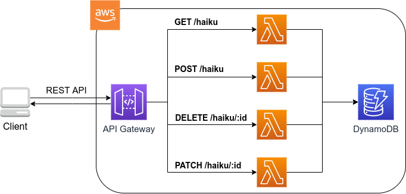
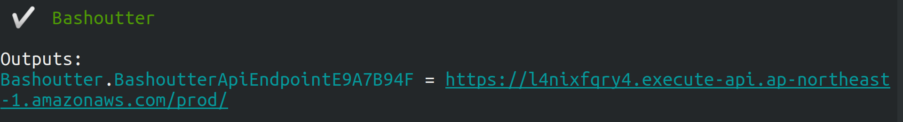

== Hands-on #5: Bashoutter

さて，最終回となるハンズオン第五回では，これまで学んできたサーバーレスクラウドの技術を使って，簡単なウェブサービスを作ってみよう．
具体的には，人々が自分の作った俳句を投稿するSNSサービス (**Bashoutter** と名付ける) を作成してみよう．

ハンズオンのソースコードはこちらのリンクに置いてある => https://gitlab.com/tomomano/intro-aws/-/tree/master/handson/05-bashoutter

[WARNING]
====
このハンズオンは，基本的に https://aws.amazon.com/free/?all-free-tier.sort-by=item.additionalFields.SortRank&all-free-tier.sort-order=asc[AWS Lambda の無料枠] の範囲内で実行することができる．
====

=== 準備

本ハンズオンの実行には，第一回ハンズオンで説明した準備 (<<handson_01_prep>>) が整っていることを前提とする．それ以外に必要な準備はない．

=== アプリケーションの説明

==== API

今回のアプリケーションでは，人々からの俳句の投稿を受け付けたり，投稿された俳句の一覧を取得する，といった機能を実装したい．
そこで， <<tab_handson_05_api>> に示すような４つの API を今回は実装する．

[[tab_handson_05_api]]
[cols="1,1"]
.Hands-on #5 で実装するAPI
|===
|`GET /haiku`
|俳句の一覧を取得する

|`POST /haiku`
|新しい俳句を投稿する

|`PATCH /haiku/{item_id}`
|`{item_id}` で指定された俳句にお気に入り票を一つ入れる

|`DELETE /haiku/{item_id}`
|`{item_id}` で指定された俳句を削除する
|===

それぞれのAPIのパラメータおよび返り値の詳細は， https://gitlab.com/tomomano/intro-aws/-/tree/master/handson/05-bashoutter/spec/swagger.yml に定義してある．

==== アプリケーションアーキテクチャ

このハンズオンで作成するアプリケーションの概要を <<handson_05_architecture>> に示す．

[[handson_05_architecture]]
.ハンズオン#5で作製するアプリケーションのアーキテクチャ

簡単にまとめると，以下のような設計である．

* クライアントからの API リクエストは， **API Gateway** (後述)にまず送信され， API の URI に従って指定された Lambda 関数へ転送される．
* それぞれの API のパスごとに独立した Lambda を用意する．
* 俳句の情報 (作者，俳句本体，投稿日時など) を記録するためのデータベース (DynamoDB) を用意する．
* 各 Lambda 関数には， DynamoDB へのアクセス権を付与する．

それでは，プログラムのソースコードを見てみよう (https://gitlab.com/tomomano/intro-aws/-/tree/master/handson/05-bashoutter/app.py[/handson/05-bashoutter/app.py])．

[source, python, linenums]
----
class Bashoutter(core.Stack):

    def __init__(self, scope: core.App, name: str, **kwargs) -> None:
        super().__init__(scope, name, **kwargs)

        # <1>
        table = ddb.Table(
            self, "Bashoutter-Table",
            partition_key=ddb.Attribute(
                name="item_id",
                type=ddb.AttributeType.STRING
            ),
            billing_mode=ddb.BillingMode.PAY_PER_REQUEST,
            removal_policy=core.RemovalPolicy.DESTROY
        )

        common_params = {
            "runtime": _lambda.Runtime.PYTHON_3_7,
            "environment": {
                "TABLE_NAME": table.table_name
            }
        }

        # <2>
        get_haiku_lambda = _lambda.Function(
            self, "GetHaiku",
            code=_lambda.Code.from_asset("api"),
            handler="api.get_haiku",
            **common_params,
        )
        post_haiku_lambda = _lambda.Function(
            self, "PostHaiku",
            code=_lambda.Code.from_asset("api"),
            handler="api.post_haiku",
            **common_params,
        )
        patch_haiku_lambda = _lambda.Function(
            self, "PatchHaiku",
            code=_lambda.Code.from_asset("api"),
            handler="api.patch_haiku",
            **common_params,
        )
        delete_haiku_lambda = _lambda.Function(
            self, "DeleteHaiku",
            code=_lambda.Code.from_asset("api"),
            handler="api.delete_haiku",
            **common_params,
        )

        # <3>
        table.grant_read_write_data(get_haiku_lambda)
        table.grant_read_write_data(post_haiku_lambda)
        table.grant_read_write_data(patch_haiku_lambda)
        table.grant_read_write_data(delete_haiku_lambda)

        # <4>
        api = apigw.RestApi(
            self, "BashoutterApi"
        )

        haiku = api.root.add_resource("haiku")
        haiku.add_method(
            "GET",
            apigw.LambdaIntegration(get_haiku_lambda)
        )
        haiku.add_method(
            "POST",
            apigw.LambdaIntegration(post_haiku_lambda)
        )

        haiku_item_id = haiku.add_resource("{item_id}")
        haiku_item_id.add_method(
            "PATCH",
            apigw.LambdaIntegration(patch_haiku_lambda)
        )
        haiku_item_id.add_method(
            "DELETE",
            apigw.LambdaIntegration(delete_haiku_lambda)
        )
----
<1> ここで，俳句の情報を記録しておくための DynamoDB テーブルを定義している．
<2> 続いて，それぞれの API で実行される Lambda 関数を定義している．
関数は Python3.7 で書かれており，コードは https://gitlab.com/tomomano/intro-aws/-/tree/master/handson/05-bashoutter/app.py[/handson/05-bashoutter/api/api.py] にある．
<3> 次に，2で定義された Lambda 関数に対し，データベースへの読み書きのアクセス権限を付与している．
<4> ここで，API Gateway により，各APIパスとそこで実行されるべき Lambda 関数を紐付けている．

1, 2 については，前章のハンズオンで詳しく見たので，特別に追加の説明は必要ないだろう．

3, 4 について，それぞれ少し詳しく説明しよう．

==== AWS における権限の管理 (IAM)

3 で強調したコードの部分を再掲する．

[source, python, linenums]
----
table.grant_read_write_data(get_haiku_lambda)
table.grant_read_write_data(post_haiku_lambda)
table.grant_read_write_data(patch_haiku_lambda)
table.grant_read_write_data(delete_haiku_lambda)
----

これまでは説明の簡略化のため敢えて触れてこなかったが， AWS には https://aws.amazon.com/iam/[IAM (Identity and Access Management] という重要な概念がある．
IAM は基本的に，あるリソースが他のリソースに対してどのような権限を持っているか，を規定するものである．
例えば， Lambda 関数が DynamoDB のデータを読み書きするためには，それを許可するような IAM が Lambda 関数に付与されていなければならない．

CDK による `dynamodb.Table` オブジェクトには `grant_read_write_data()` という便利なメソッドが備わっており，アクセスを許可したい Lambda 関数を引数としてこのメソッドを呼ぶことで，データベースへの読み書きを許可する IAM を付与することができる．

==== API Gateway

https://aws.amazon.com/api-gateway/[API Gateway] とは， API の"入り口"として，APIのリクエストパスに従って Lambda 関数などに接続を行うという機能を担う．
このような API のリソースパスに応じて接続先を振り分けるようなサーバーを**ルーター**と呼んだりする．
従来的には，ルーターにはそれ専用の仮想サーバーが置かれることが一般的であったが， API Gateway はその機能をサーバーレスで担ってくれる．
すなわち， API のリクエストが来たときのみ起動し，API が来ていない間は完全にシャットダウンしている．
一方で，アクセスが大量に来た場合はそれに比例してルーティングの処理能力を増大してくれる．

API Gateway を配置することで，大量 (１秒間に数千から数万件)の API リクエストに対応することのできるシステムを容易に構築することができる．
API Gateway の料金は <<tab_handson_05_apigateway_price>> のように設定されている．
また，無料利用枠により，月ごとに100万件までのリクエストは0円で使用できる．

[[tab_handson_05_apigateway_price]]
[cols="1,1", options="header"]
.API Gateway の利用料金設定 (https://aws.amazon.com/api-gateway/pricing/[参照])
|===
|Number of Requests (per month)
|Price (per million)

|First 333 million
|$4.25

|Next 667 million
|$3.53

|Next 19 billion
|$3.00
|Over 20 billion
|$1.91
|===

ソースコードの該当箇所を見てみよう．

[source, python, linenums]
----
api = apigw.RestApi(
    self, "BashoutterApi"
)

haiku = api.root.add_resource("haiku")
haiku.add_method(
    "GET",
    apigw.LambdaIntegration(get_haiku_lambda)
)
haiku.add_method(
    "POST",
    apigw.LambdaIntegration(post_haiku_lambda)
)

haiku_item_id = haiku.add_resource("{item_id}")
haiku_item_id.add_method(
    "PATCH",
    apigw.LambdaIntegration(patch_haiku_lambda)
)
haiku_item_id.add_method(
    "DELETE",
    apigw.LambdaIntegration(delete_haiku_lambda)
)
----

* `api = apigw.RestApi()` により，空の API Gateway を作成している．
* 次に， `api.root.add_resource()` のメソッドを呼ぶことで， `/haiku` という API パスを追加している．
* 続いて， `add_method()` を呼ぶことで， `GET`, `POST` のメソッドを `/haiku` のパスに定義している．
* さらに， `haiku.add_resource("{item_id}")` により， `/haiku/{item_id}` という API パスを追加している．
* 最後に， `add_method()` を呼ぶことにより， `PATCH`, `DELETE` のメソッドを `/haiku/{item_id}` のパスに定義している．

このように， 逐次的に API パスとそこで実行されるメソッド・Lambda を記述していくだけでよい．

=== アプリケーションのデプロイ

アプリケーションの中身が理解できたところで，早速デプロイを行ってみよう．

デプロイの手順は，これまでのハンズオンとほとんど共通である．
ここでは，コマンドのみ列挙する (`#` で始まる行はコメントである)．
それぞれの意味を忘れてしまった場合は，ハンズオン1, 2に戻って復習していただきたい．

[source, bash]
----
# プロジェクトのディレクトリに移動
$ cd intro-aws/handson/05-bashoutter

# venv を作成し，依存ライブラリのインストールを行う
$ python3 -m venv .env
$ source .env/bin/activate
$ pip install -r requirements.txt

# AWS の認証情報をセットする
# 自分自身の認証情報に置き換えること！
export AWS_ACCESS_KEY_ID=XXXXXX
export AWS_SECRET_ACCESS_KEY=YYYYYY
export AWS_DEFAULT_REGION=ap-northeast-1

# デプロイを実行
$ cdk deploy
----

デプロイのコマンドが無事に実行されれば， <<handson_05_cdk_output>> のような出力が得られるはずである．
ここで表示されている `Bashoutter.BashoutterApiEndpoint = XXXX` の XXX の文字列が，APIのエンドポイントになる．
次に使うのでメモしておこう．

[[handson_05_cdk_output]]
.CDKデプロイ実行後の出力

[TIP]
====
上記のデプロイで得られた API のエンドポイントは API Gateway によりランダムに作成されたアドレスである．
このアドレスを DNS に登録することで，自分の好きなドメイン名 (例: api.example.com) と結びつけることが可能である．
====

AWS コンソールにログインして，デプロイされたスタックを確認してみよう．
コンソールから， API Gateway のページに行くと， <<handson_05_apigw_console_list>> のような画面が表示され，デプロイ済みの API エンドポイントの一覧が確認できる．

[[handson_05_apigw_console_list]]
.API Gateway コンソール画面 (1)
image::imgs/handson-05/apigw_console_list.png[apigw_console_list, 700, align="center"]

今回デプロイした "BashoutterApi" という名前の API をクリックすることで <<handson_05_apigw_console_detail>> のような画面に遷移し，詳細情報を閲覧できる．
`GET /haiku`, `POST /haiku` などが定義されていることが確認できる．

それぞれのメソッドをクリックすると，そのメソッドの詳細情報を確認できる．
API Gateway は，上で説明したルーティングの機能だけでなく，認証機能などを追加することも可能であり，そのような理由で 
<<handson_05_apigw_console_detail>> で画面右端赤色で囲った部分に，この API で呼ばれる Lambda 関数が指定されている．
関数名をクリックすることで，関数の中身を閲覧することが可能である．

[[handson_05_apigw_console_detail]]
.API Gateway コンソール画面 (2)
image::imgs/handson-05/apigw_console_detail.png[apigw_console_detail, 700, align="center"]

=== API を送信する

それでは，実際に API を送信してみよう．
ここではコマンドラインから API を送信するためのシンプルなHTTPクライアントである https://httpie.org/[HTTPie] を使ってみよう．
HTTPie は，スタックをデプロイするときに Python 仮想環境を作成した際，一緒にインストールした．
コマンドラインに `http` と打ってみて，コマンドの使い方が出力されることを確認しよう．

まず最初に，先ほどデプロイを実行した際に得られた API のエンドポイントの URL をコマンドラインの変数に設定しておく．

[source, bash]
----
$ export ENDPOINT_URL=https://XXXX.execute-api.ap-northeast-1.amazonaws.com/prod/
----

[WARNING]
====
上のコマンドで，URLは自分のデプロイしたスタックのURLに置き換える．
====

次に，俳句の一覧を取得するため， `GET /haiku` の API を送信してみよう．

[source, bash]
----
$ http GET "${ENDPOINT_URL}/haiku"
----

現時点では，まだだれも俳句を投稿していないので，空の配列 (`[]`) が返ってくる．

それでは次に，俳句を投稿してみよう．

[source, bash]
----
$ http POST "${ENDPOINT_URL}/haiku" \
username="松尾芭蕉" \
first="閑さや" \
second="岩にしみ入る" \
third="蝉の声"
----

以下のような出力が得られるだろう．

----
HTTP/1.1 201 Created
Connection: keep-alive
Content-Length: 49
Content-Type: application/json
....
{
    "description": "Successfully added a new haiku"
}
----

新しい俳句を投稿することに成功したようである．
本当に俳句が追加されたか，再び GET リクエストを呼ぶことで確認してみよう．

[source, bash]
----
$ http GET "${ENDPOINT_URL}/haiku"

HTTP/1.1 200 OK
Connection: keep-alive
Content-Length: 258
Content-Type: application/json
...
[
    {
        "created_at": "2020-07-06T02:46:04+00:00",
        "first": "閑さや",
        "item_id": "7e91c5e4d7ad47909e0ac14c8bbab05b",
        "likes": 0.0,
        "second": "岩にしみ入る",
        "third": "蝉の声",
        "username": "松尾芭蕉"
    }
]
----

素晴らしい！

次に， `PATCH /haiku/{item_id}` を呼ぶことでこの俳句にいいねを追加してみよう．
上のコマンドで取得した俳句の `item_id` を，下のコマンドの `XXXX` 

[source, bash]
----
$ http PATCH "${ENDPOINT_URL}/haiku/XXXX"
----

再び GET リクエストを送ることで，いいね (`likes`) が1増えたことを確認しよう．

[source, bash]
----
$ http GET "${ENDPOINT_URL}/haiku"
...
[
    {
        ...
        "likes": 1.0,
        ...
    }
]
----

最後に， DELETE リクエストを送ることで俳句をデータベースから削除しよう．
`XXXX` は `item_id` の値で置き換えた上で以下のコマンドを実行する．

[source, bash]
----
$ http DELETE "${ENDPOINT_URL}/haiku/XXXX"
----

再び GET リクエストを送ることで，返り値が空 (`[]`) になっていることを確認しよう．

以上のような形で， SNS に必要な基本的な API を実装することができた．

=== 大量の API リクエストをシミュレートする

さて，前節ではマニュアルでひとつづづ俳句を投稿した．
多数のユーザーがいるような SNS では，一秒間に数千件以上の投稿がされている．
サーバーレスアーキテクチャを採用することで，そのような瞬間的な大量アクセスにも容易に対応できるようなシステムが構築できる．

その点をデモンストレートするため，ここでは大量の API が送信された状況をシミュレートしてみよう．

https://gitlab.com/tomomano/intro-aws/-/tree/master/handson/05-bashoutter/client.py[/handson/05-bashoutter/client.py] に，大量のAPIリクエストをシミュレートするためのプログラムが書かれている．
このプログラムは基本的に `POST /haiku` の API リクエストを指定された回数だけ実行する．

テストとして， API を300回送ってみよう．
以下のコマンドを実行する．

[source, bash]
----
python client.py $ENDPOINT_URL post_many 300
----

数秒のうちに実行が完了するだろう．
これがもし，単一のサーバーからなる API だったとしたら，このような大量のリクエストの処理にはもっと時間がかかっただろう．
従って，今回作成したサーバーレスアプリケーションは，シンプルながらも一秒間に数百件の処理を行えるような，スケーラブルなクラウドシステムであることがわかる．
サーバーレスでクラウドを設計することの利点を垣間見ることができただろうか？

=== アプリケーションの削除

これにて，第五回ハンズオンは終了である．最後にスタックを削除しよう．

スタックを削除するには，次のコマンドを実行すればよい．

[source, bash]
----
$ cdk destroy
----

=== 講義第三回目のまとめ

