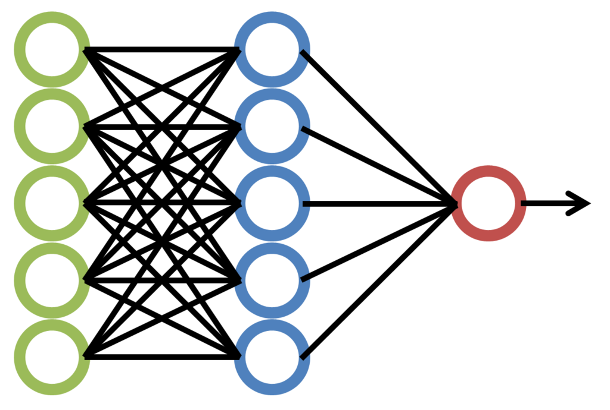

== クラウドで行う科学計算・機械学習

ここからが第二回目の講義の内容になる．

第二回目は，前回学んだクラウドの知識・技術を使って，現実的な問題を解くことを考える．

計算機が発達した現代では，計算機によるシミュレーションやビッグデータの解析は，科学・エンジニアリングの研究の主要な柱である．
これらの大規模な計算を実行するには，クラウドは最適である．
本講義では，どのようにしてクラウド上で科学計算を実行するのかを，ハンズオンとともに体験してもらう．
科学計算の具体的な題材として，今回は機械学習(ディープラーニング)を取り上げる．

なお，本講義では https://pytorch.org/[PyTorch] ライブラリを使ってディープラーニングのアルゴリズムを走らせるが，ディープラーニングおよび PyTorch の知識は不要である．
講義ではなぜ・どうやってディープラーニングをクラウドで実行するか，に主眼を置いているので，実行するプログラムの詳細には立ち入らない．
将来自分でディープラーニングを使う機会が来たときに，詳しく学んでもらいたい．

=== なぜ機械学習をクラウドで行うのか？

2010年代後半に始まったAIブームのおかげで，研究だけでなく社会・ビジネスの文脈でも機械学習に高い関心が寄せられている．
特に，ディープラーニングと呼ばれる多層のレイヤーからなるニューラルネットワークを用いたアルゴリズムは，画像認識や自然言語処理などの分野で圧倒的に高い性能を実現し，革命をもたらしている．

ディープラーニングの特徴は，なんといってもそのパラメータの多さである．
層が深くなるほど，層間のニューロンを結ぶ"重み"パラメータの数が増大していく．
例えば，最新の言語モデルである https://arxiv.org/abs/2005.14165[GPT-3] には**1750億個**ものパラメータが含まれている！
このような膨大なパラメータを有することで，ディープラーニングは高い表現力と汎化性能を実現しているのである．

.ニューラルネットワーク

GPT-3 に限らず，最近の SOTA (State-of-the-art) の性能を達成するニューラルネットでは，百万から億のオーダーのパラメータを有することは頻繁になってきている．そのような巨大なニューラルネットを学習(トレイン)させるのは，当然のことながら巨大な計算コストがかかる．そんな巨大な計算に最適なのが，クラウドである！事実，GPT-3の学習も，詳細は明かされていないが，Microsoft社のクラウドを使って行われたと報告されている．

[TIP]
====
GPT-3 が発表された時，そのモデルがもつ表現能力には多くの人が驚嘆させられた． https://openai.com/blog/better-language-models/#task5[OpenAI] のブログに，モデルが出力した翻訳や文章要約のタスクの結果が紹介されている．
====

=== GPU による機械学習の高速化

ディープラーニングの計算で欠かすことのできない技術として， **GPU (Graphics Processing Unit)** について少し説明する．

GPUは，その名のとおり，元々はコンピュータグラフィックスを出力するための専用計算チップである．CPU (Central Processing Unit) に対し，グラフィックスの演算に特化した設計がなされている．身近なところでは，XBoxやPS4などのゲーム機などに搭載されているし，ハイスペックなノートパソコンやデスクトップコンピュータにも搭載されていることがある．コンピュータグラフィクスでは，スクリーンにアレイ状に並んだ数百万個の画素をリアルタイムで処理する必要がある．そのため，GPUは，コアあたりの演算能力は比較的弱いかわりに，チップあたり数百から数千のオーダーでコアを搭載しており，画面の画素を並列的に処理することで，リアルタイムでの表示を実現している．

.GPUのアーキテクチャ (画像出典: https://devblogs.nvidia.com/nvidia-turing-architecture-in-depth/)
image::imgs/gpu_architecture.jpg[cdk output, 500, align="center"]

このように，コンピュータグラフィクスの目的で生まれたGPUだが，2010年前後から，その高い並列計算能力を科学的な計算に用いる，という流れ (**General-purpose computing on GPU; GPGPU**) が生まれた．GPUのコアは，その設計から，行列の四則演算など，単純かつ容易に並列化できるような演算が得意であり，そのような演算に対しては数個程度のコアしか持たないCPUに比べて圧倒的に高い計算速度を実現することができる．現在ではGPGPUは分子動力学や気象シミュレーション，そして機械学習など多くの分野で使われている．

ディープラーニングで最も頻繁に起こる演算が，ニューロンの出力を次の層のニューロンに伝える畳み込み (Convolution) 演算である．畳み込み演算は，まさにGPUが得意とする演算であり，CPUではなくGPUを用いることで学習を飛躍的に(数百倍程度！)加速させることができる．

クラウドでGPUを使うには，GPUが搭載された特別なインスタンスタイプを選択しなければならない．

[TIP]
====
GPT-3 で使われた計算リソースの詳細は論文でも明かされていないのだが， https://lambdalabs.com/blog/demystifying-gpt-3/[Lambda社のブログ]で興味深い考察が行われている (Lambda社は機械学習に特化したクラウドサービスを提供している)．

記事によると，1750億のパラメータを学習するには，一台のGPU (NVIDIA社製 V100)を用いた場合，342年の月日と460万ドルのクラウド利用料が必要となる，とのことである．GPT-3のチームは，複数のGPUに処理を分散することで現実的な時間のうちに学習を完了させたのであろうが，このレベルのモデルになってくるとクラウド技術の限界を攻めないと達成できないことは確かである．
====

