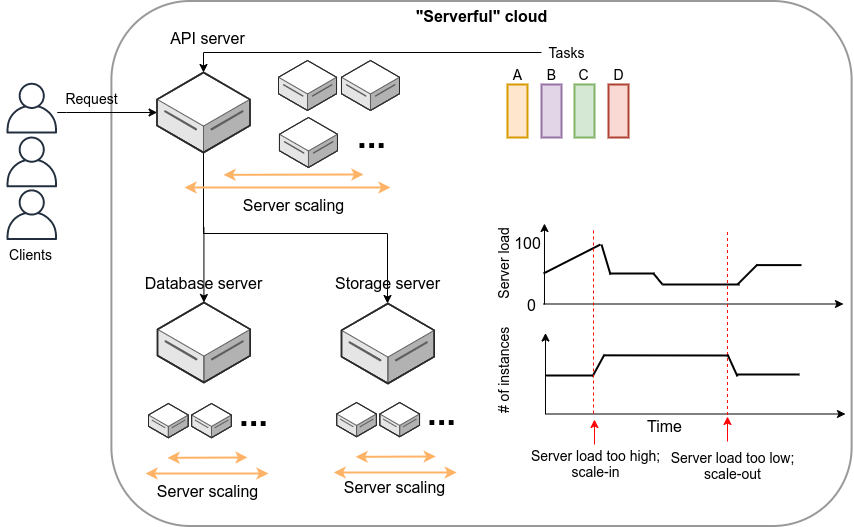

== Serverless architecture

Serverless Architecture あるいは Serverless Computing とは， 従来とは全くアプローチの異なるクラウドシステムの設計方法である．
歴史的には， AWS が2014年に発表した https://aws.amazon.com/lambda/[Lamba] がサーバーレスアーキテクチャの最初の先駆けとされている．
その後， Google や Microsoft などのクラウドプラットフォームも同様の機能の提供を開始している．
サーバーレスアーキテクチャの利点は，スケーラブルなクラウドシステムを安価かつ簡易に作成できる点であり，近年いたるところで導入が進んでいる．

Serverless とは，文字通りの意味としてはサーバーなしで計算をするということになるが，それは一体どういう意味だろうか？
サーバーレスについて説明するためには，まずは従来的な， "serverful" と呼ばれるようなシステムについて解説しなければならない．

=== Serverful クラウド (従来型)

従来的なクラウドシステムのスケッチを <<serverful>> に示す．
クライアントから送信されたリクエストは，まず最初にAPIサーバーに送られる．
API サーバーでは，リクエストの内容に応じてタスクが実行される．
タスクには，APIサーバーだけで完結できるものもあるが，多くの場合，データベースの読み書きが必要である．
データベースには，データベース専用の独立したサーバーマシンが用いられることが一般的である．
また，画像や動画などもデータは，また別のストレージサーバーに保存されることが一般的である．
これらの APIサーバー，データベースサーバー，ストレージサーバーはそれぞれ独立したサーバーマシンであり， AWS では EC2 を使った仮想インスタンスを想定してもらったら良い．

多くのウェブサービスでは，多数のクライアントからのリクエストを処理するため，複数のサーバーマシンがクラウド内で起動し，負荷を分散するような設計がなされている．
クライアントから来たリクエストを計算容量に余裕のあるサーバーに振り分けるような操作を **Load balancing** とよび，そのような操作を担当するマシンのことを **Load balancer** という． 

Load balancing の目的でたくさんのインスタンスを起動するのはよいのだが，それぞれがなんの計算もせず，ただ新しいタスクが来るのを待っているようではコストと電力の無駄遣いである．
したがって，全てのサーバーが常に目標とする計算負荷を維持するよう，計算の負荷に応じてクラスター内の仮想サーバーの数を動的に増減させるような仕組みが必要である．
そのような仕組みを**クラスターのスケーリング**とよび，負荷の増大に応答して新しい仮想インスタンスをクラスターに追加する操作を **scale-in**，負荷の減少に応答してインスタンスをシャットダウンする操作を **scale-out** と呼ぶ．
クラスターのスケーリングは，各インスタンスを監視・統括するようなひとつ階層が上のサーバーを配置することで自動的に実行されるような設計がなされる．
クラスターのスケーリングは， API サーバーではもちろんのこと，データベースサーバー・ストレージサーバーでも必要になることが多い．
**クラウドシステム内すべてのインスタンスで，負荷が均一になるような調整が必要なのである．**

[[serverful]]
.Serverful なクラウドシステム

=== Serverless クラウドへ

上述したように，従来のクラウドシステムの設計で非常に重要なのが，クラスターのスケーリングである．
コストパフォーマンスを最大化するには，各サーバーの稼働率を100%に近づけるようなスケーリングのパラメータの調整が必要である．
しかしながら，クラスターのスケーリングの最適化はかなり手間のかかる作業である．

さらに問題を複雑にするのは，APIサーバーで処理されるべきタスクが，非一様である点である．
非一様であるとは，例えばタスクAは3000ミリ秒の実行時間と 512MB のメモリーを消費し，別のタスクBは1000ミリ秒の実行時間と 128MB のメモリーを消費する，というような状況を差している．
一つのサーバーマシンが計算負荷が異なる複数のタスクを処理する場合，クラスターのスケーリングはより複雑になる．
この状況をシンプルにするために，１サーバーで実行するタスクは１種類に限る，という設計も可能であるが，そうするとで生まれる弊害も多い (ほとんど使われないタスクに対してもサーバー一台をまるまる割り当てなければならない = ほとんどアイドリング状態になってしまう，など)．

もっとシンプルで見通しの良いクラウドシステムのスケーリングの仕組みはないだろうか？

従来の serverful なシステムでの最大の問題点は，**サーバーをまるまる占有してしまう**という点にある．
すなわち， EC2 インスタンスを起動したとき，そのインスタンスは起動したユーザーだけが使えるものであり，**計算のリソース (CPUやRAM) が独占的に割り当てられた状態**になる．
固定した計算資源の割り当てがされてしまっているので，**インスタンスの計算負荷が0%であろうが100%であろうが，均一の使用料金が起動時間に比例**して発生する．

サーバーレスアーキテクチャは，このような **独占的に割り当てられた計算リソースというものを完全に廃止する．**
サーバーレスアーキテクチャでは，計算のリソースは，クラウドプロバイダーが全て管理する．
クライアントは実行したいプログラムをクラウドに提出する．
クラウドプロバイダーは，自身の持つ巨大な計算リソースから空きを探し，提出されたプログラムを実行し，実行結果をクライアントに返す．
以上を図示すると， <<serverless>> のようになる．

[[serverless]]
.従来のクラウドと Serverless クラウドの比較
image::imgs/serverless.png[serverless, 700, align="center"]

サーバーレスクラウドを利用することで，**クラウドのコストは実際に使用した計算の総量 (CPU稼働時間) で決定される**ことになる．
これは，計算の実行総量に関わらずインスタンスの起動時間で料金が決定されていた従来のシステムと比べて大きな違いである．

これまで，抽象的な説明が続いてきたが，以下では AWS のサーバーレスクラウドに実際に触れてみることで，より具体的な例を見ていこう．

